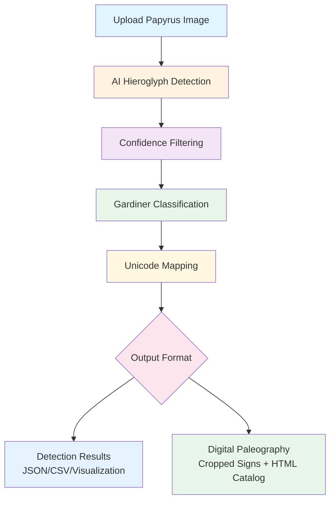

# PapyrusVision: AI-Powered Hieroglyph Detection and Digital Paleography

[](https://www.python.org/downloads/)
[](https://streamlit.io)
[](https://github.com/facebookresearch/detectron2)
[](https://opensource.org/licenses/MIT)

## Table of Contents

1. [Overview](#overview)
2. [Pipeline Overview](#pipeline-overview)
3. [Quick Start](#quick-start)
   - [One-Click Installation](#one-click-installation-recommended)
   - [Manual Installation](#manual-installation-advanced-users)
4. [Features](#features)
   - [Unified Web Application](#unified-web-application)
5. [Usage Options](#usage-options)
   - [Web Application](#web-application-recommended)
   - [Command-Line Tool](#command-line-tool)
   - [Maintenance Tools](#maintenance-tools)
6. [Project Structure](#project-structure)
7. [Output Formats](#output-formats)
   - [Detection Results](#detection-results)
   - [Digital Paleography](#digital-paleography)
   - [Advanced Analytics](#advanced-analytics)
   - [Image Processing Enhancements](#image-processing-enhancements)
   - [Scholarly Integration](#scholarly-integration)
8. [Documentation](#documentation)
9. [Contributing](#contributing)
10. [License](#license)
11. [Citation](#citation)
12. [Author & Support](#author--support)
13. [References](#references)

## Overview

PapyrusVision is an AI-powered digital paleography tool for ancient Egyptian hieroglyph analysis. This system combines deep learning with Egyptological knowledge to provide papyrus analysis, automated sign detection, and digital paleography generation.

**Training Data**: The model was trained on 2,431 manually annotated hieroglyphs from Spell 145 in the Book of the Dead of Nu (British Museum EA 10477), covering 177 distinct Gardiner sign categories. This 18th Dynasty papyrus provides examples of classical Egyptian hieroglyphic writing, ensuring the model learned from high-quality scholarly sources. All annotations were created using CVAT (Computer Vision Annotation Tool).

**Model Performance**: The trained Detectron2 model achieves mAP@0.5 of 0.73 and mAP@0.5:0.95 of 0.41 across 177 Gardiner sign categories with Unicode coverage for 594+ official mappings.

## Pipeline Overview



**Process Flow:**
1. **Input**: High-resolution papyrus images
2. **Detection**: AI-powered hieroglyph detection using Detectron2
3. **Classification**: Automatic Gardiner code assignment
4. **Enhancement**: Unicode symbol mapping and metadata enrichment  
5. **Paleography**: One-click generation of cropped signs and interactive catalogs
6. **Output**: Multiple formats for research and analysis

## Quick Start

### One-Click Installation (Recommended)

**Method 1: Download ZIP (No Git Required)**
1. [Download ZIP](https://github.com/margotbelot/PapyrusVision/archive/refs/heads/main.zip) from GitHub
2. Extract the ZIP file to your desired location
3. Open terminal/command prompt in the extracted folder
4. Run: `python3 install.py`

**Method 2: Git Clone**
```bash
# Clone the repository
git clone https://github.com/margotbelot/PapyrusVision.git
cd PapyrusVision

# Run the automated installer
python3 install.py
```

**What the installer does:**
- Checks system requirements (Python 3.8+, disk space)
- Creates isolated virtual environment
- Installs all dependencies automatically
- Detects your system (Windows/macOS/Linux) and installs appropriate versions
- Handles Detectron2 installation for your platform (CPU/GPU)
- Creates launch scripts for easy startup
- Verifies everything works correctly

**After installation, launch the app:**

```bash
./run_with_env.sh streamlit run apps/unified_papyrus_app.py
```

Your browser will automatically open to `http://localhost:8501`

**Quick Demo:** The app includes a built-in test image (Book of the Dead of Nu, Spell 145) - just click "Analyze Image" to see instant results!

> **For advanced installation, development setup, and technical details, see [docs/TECHNICAL_GUIDE.md](docs/TECHNICAL_GUIDE.md)**

### Manual Installation (Advanced Users)

<details>
<summary>Click to expand manual installation instructions</summary>

**1. Install Dependencies**
```bash
# Create virtual environment (recommended)
python -m venv papyrus_env
source papyrus_env/bin/activate  # On Windows: papyrus_env\Scripts\activate

# Install core dependencies
pip install -r requirements.txt
```

**2. Install Detectron2**

**macOS Apple Silicon (M1/M2/M3):**
```bash
pip install torch torchvision torchaudio
pip install 'git+https://github.com/facebookresearch/detectron2.git'
```

**Linux/Windows with GPU:**
```bash
pip install torch torchvision torchaudio --index-url https://download.pytorch.org/whl/cu118
pip install detectron2 -f https://dl.fbaipublicfiles.com/detectron2/wheels/cu118/torch2.0/index.html
```

**CPU-only (any platform):**
```bash
pip install torch torchvision torchaudio --index-url https://download.pytorch.org/whl/cpu
pip install detectron2 -f https://dl.fbaipublicfiles.com/detectron2/wheels/cpu/torch2.0/index.html
```

**3. Run the Application**
```bash
streamlit run apps/unified_papyrus_app.py
```

</details>

## Features

### Unified Web Application

**Streamlit Interface:**
- **Dual-Tab Design**: Single Image Analysis + Digital Paleography workflows
- **Built-in Test Image**: Instant demo with Book of the Dead of Nu (Spell 145)
- **Professional UI**: Egyptian-themed styling with intuitive navigation
- **Responsive Design**: Works on desktop, tablet, and mobile devices

**AI Detection:**
- **Model**: Detectron2-based detection with 73% mAP@0.5
- **177 Gardiner Categories**: Comprehensive hieroglyphic sign classification
- **Confidence Filtering**: Adjustable thresholds (0.1-0.95) with real-time preview
- **Interactive Visualization**: Color-coded detection boxes with confidence scores
- **Image Processing**: Advanced crop enhancement and noise reduction

**Real-time Analytics:**
- **Detection Quality Analysis**: Automatic confidence distribution charts
- **Frequency Statistics**: Most common signs with percentages
- **Downloadable Reports**: JSON analytics with complete metadata
- **Visual Charts**: Publication-ready PNG charts for presentations

**Professional Digital Paleography:**
- **Automated Cropping**: AI sign extraction with quality optimization
- **Gardiner Organization**: Signs grouped by classification codes
- **High-Resolution Output**: 150px export crops with CLAHE enhancement
- **Interactive Preview**: Browse results before downloading
- **Complete Catalogs**: Professional HTML documentation with embedded images

**Comprehensive Export Options:**
- **Multiple Formats**: CSV, JSON, HTML, ZIP archives
- **Scholarly Metadata**: Complete provenance and analysis parameters
- **Publication-Ready**: Professional HTML catalogs for academic use
- **Batch Downloads**: Single-click ZIP packages with organized folder structures

## Usage Options

### Web Application (Recommended)

**Single Image Analysis Tab:**
- **Quick Start**: Built-in test image or upload your own (PNG, JPG, JPEG, TIFF)
- **Real-time Detection**: AI-powered analysis with interactive visualization
- **Detailed Results**: Confidence scores, bounding boxes, Gardiner classifications
- **Advanced Analytics**: Quality breakdown charts, frequency analysis, downloadable reports
- **Export Options**: CSV and JSON formats with complete metadata
- **Professional Visualization**: matplotlib charts with detection overlays

**Digital Paleography Tab:**
- **Complete Workflow**: Upload → Detect → Crop → Catalog → Download
- **Smart Cropping**: Advanced image processing with noise reduction and sharpening
- **Organized Display**: Signs grouped by Gardiner codes with confidence ranges
- **Interactive Preview**: Browse cropped signs before exporting
- **Professional Output**: HTML catalogs with embedded high-quality images
- **Research-Grade**: ZIP archives with organized folder structures and metadata

**Built-in Analytics:**
- **Detection Quality**: Automatic confidence distribution analysis
- **Frequency Charts**: Most common hieroglyphic signs with statistics
- **Downloadable Visualizations**: High-resolution PNG charts for presentations
- **Comprehensive Reports**: JSON analytics with complete detection metadata

### Command-Line Tool

```bash
# Individual analysis with optional export control
./run_with_env.sh python scripts/hieroglyph_analysis_tool.py --image path/to/image.jpg
./run_with_env.sh python scripts/hieroglyph_analysis_tool.py --no_export  # Skip file generation

# Install additional packages
./run_with_env.sh pip install some-package

# Access Jupyter notebooks
./run_with_env.sh jupyter notebook
```

### Maintenance Tools

**Interactive environment** (for development/debugging):
```bash
./run_with_env.sh  # Opens shell with environment activated
```

**Clean macOS metadata files** (if needed):
```bash
find . -name '._*' -type f -delete  # Remove ._ files manually
```

## Project Structure

PapyrusVision follows a standard research project structure:

- **`apps/`** - User-facing applications (web interface)
- **`scripts/`** - Core analysis and processing tools  
- **`notebooks/`** - Jupyter analysis pipeline (5 notebooks covering full workflow)
- **`models/`** - Trained AI models and configurations
- **`data/`** - Dataset, annotations, and generated visualizations
- **`docs/`** - Technical documentation

> **For detailed project structure with all files and descriptions, see [docs/TECHNICAL_GUIDE.md](docs/TECHNICAL_GUIDE.md)**

## Output Formats

### Detection Results
- **Bounding Boxes**: Precise coordinates with confidence scores
- **Gardiner Classification**: Automatic sign categorization (177+ codes)
- **Rich Metadata**: Timestamps, thresholds, image information
- **Multiple Formats**: JSON (complete), CSV (tabular), PNG (visualizations)
- **Analytics Reports**: Confidence distributions, frequency statistics

### Digital Paleography
- **High-Quality Crops**: 150px enhanced images with noise reduction
- **Smart Organization**: Automatic Gardiner code grouping
- **Professional Catalogs**: Interactive HTML with embedded images
- **Complete Archives**: ZIP packages with organized folder structures
- **Scholarly Documentation**: Metadata, provenance, analysis parameters

### Advanced Analytics
- **Quality Analysis**: Detection confidence breakdowns with charts
- **Frequency Statistics**: Most common signs with percentages
- **Visual Reports**: Publication-ready PNG charts and graphs
- **Comprehensive Data**: JSON exports with complete analysis metadata

### Image Processing Enhancements

**Advanced Crop Processing:**
- **Smart Scaling**: Optimal sizing (120px display, 150px export) with quality-based limits
- **Noise Reduction**: Advanced denoising algorithms for cleaner results
- **Adaptive Sharpening**: Size-based kernel selection for optimal clarity
- **CLAHE Enhancement**: Contrast Limited Adaptive Histogram Equalization
- **Quality Interpolation**: Resizing methods (LANCZOS, CUBIC, AREA)

### Scholarly Integration

**Example Detection Output:**
```
D4   | Eye          | 87.3% confidence
N35  | Water ripple | 92.1% confidence
G43  | Quail chick  | 79.8% confidence
M17  | Reed leaf    | 94.5% confidence
  ↑        ↑            ↑
Code   Description  Confidence
```

## Documentation

For complete technical documentation, training details, and advanced usage, see [docs/TECHNICAL_GUIDE.md](docs/TECHNICAL_GUIDE.md)

## Contributing

1. Fork the repository
2. Create a feature branch (`git checkout -b feature/feature`)
3. Commit your changes (`git commit -m 'Add feature'`)
4. Push to the branch (`git push origin feature/feature`)
5. Open a Pull Request

## License

This project is licensed under the MIT License - see the [LICENSE](LICENSE) file for details.

## Citation

If you use this work in your research, please cite:

```bibtex
@misc{papyrusvision2025,
  title={PapyrusVision: AI-Powered Hieroglyph Detection and Digital Paleography},
  author={Margot Belot},
  year={2025},
  url={https://github.com/margotbelot/PapyrusVision}
}
```

## Author & Support

**Margot Belot**
- GitHub: [@margotbelot](https://github.com/margotbelot)
- Email: margotbelot@icloud.com

For questions or support, please [open an issue](https://github.com/margotbelot/PapyrusVision/issues) or contact margotbelot@icloud.com

## References

### Primary Sources
- **Digital Archive**: [Thesaurus Linguae Aegyptiae - Book of the Dead of Nu](https://tla.digital/object/7NOILVRXDVBPZBXA4S4FRIHTMA)
- **British Museum Collection**: [BM EA 10477](https://www.britishmuseum.org/collection/object/Y_EA10477-25)

### Scholarly Publications
- **Lapp, G.** (1997). *The Papyrus of Nu (BM EA 10477)*. Catalogue of Books of the Dead in the British Museum I. London: British Museum Press.

### Technical References
- **Detectron2**: He, K., et al. (2019). Detectron2. Facebook AI Research.
- **CVAT**: Computer Vision Annotation Tool. Intel Corporation.
- **Unicode Standard**: Unicode Egyptian Hieroglyphs Block (U+13000–U+1342F).
