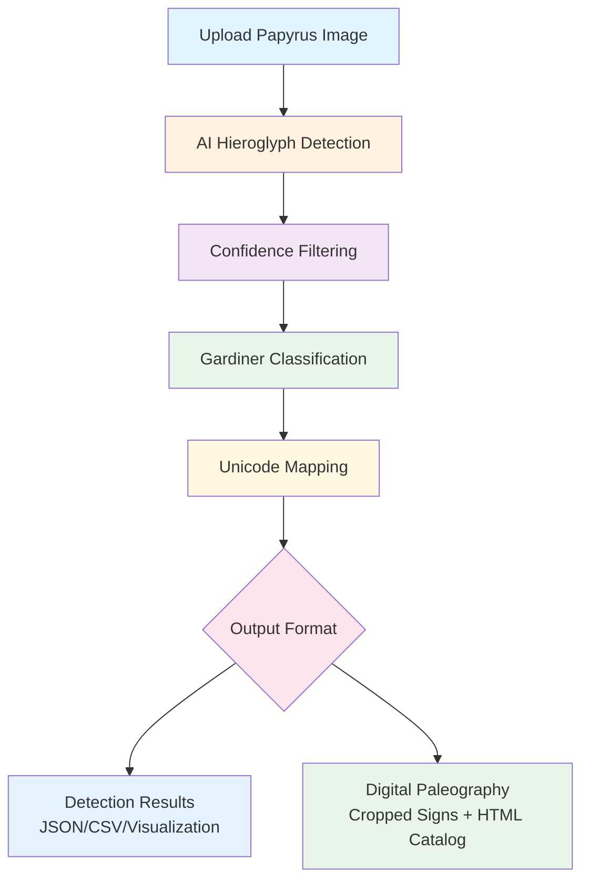

# PapyrusVision: AI-Powered Hieroglyph Detection and Digital Paleography

[](https://www.python.org/downloads/)
[](https://streamlit.io)
[](https://github.com/facebookresearch/detectron2)
[](https://opensource.org/licenses/MIT)
[](#)

## Table of Contents

1. [Overview](#overview)
2. [Quick Start](#quick-start)
3. [Features](#features)
4. [Usage](#usage)
5. [Documentation](#documentation)
6. [Citation & Support](#citation--support)

## Overview

PapyrusVision is an AI-powered digital paleography tool for ancient Egyptian hieroglyph analysis. This system combines deep learning with Egyptological knowledge to provide papyrus analysis, automated sign detection, and digital paleography generation.

**Training Data**: The model was trained on 2,431 manually annotated hieroglyphs from the Book of the Dead of Nu (British Museum EA 10477), covering 177 distinct Gardiner sign categories. This ensures high-quality, scholarly-accurate detection.

**Performance**: Achieves 73% accuracy in detecting hieroglyphic signs with comprehensive Unicode support for scholarly research.

## Pipeline Overview



**How it works:**
1. Upload papyrus images
2. AI detects and classifies hieroglyphic signs  
3. Generate digital paleography catalogs
4. Export results in multiple formats

## Quick Start

### One-Click Installation (Recommended)

**Method 1: Download ZIP (No Git Required)**
1. [Download ZIP](https://github.com/MargotBelot/PapyrusVision/archive/refs/heads/main.zip) from GitHub
2. Extract the ZIP file to your desired location
3. Open terminal/command prompt in the extracted folder
4. Run: `python3 install.py`

**Method 2: Git Clone**
```bash
# Clone the repository
git clone https://github.com/MargotBelot/PapyrusVision.git
cd PapyrusVision

# Run the automated installer
python3 install.py
```

**What the installer does:**
- Checks system requirements (Python 3.8+, disk space)
- Creates isolated virtual environment
- Installs all dependencies automatically
- Detects your system (Windows/macOS/Linux) and installs appropriate versions
- Handles Detectron2 installation for your platform (CPU/GPU)
- Creates launch scripts for easy startup
- Verifies everything works correctly

**After installation, launch the app:**

```bash
./run_with_env.sh streamlit run apps/unified_papyrus_app.py
```

Your browser will automatically open to `http://localhost:8501`

**Quick Demo:** The app includes a built-in test image (Book of the Dead of Nu, Spell 145) - just click "Analyze Image" to see instant results!

> **For advanced installation, development setup, and technical details, see [docs/TECHNICAL_GUIDE.md](docs/TECHNICAL_GUIDE.md)**

### Manual Installation (Advanced Users)

<details>
<summary>Click to expand manual installation instructions</summary>

**1. Install Dependencies**
```bash
# Create virtual environment (recommended)
python -m venv papyrus_env
source papyrus_env/bin/activate  # On Windows: papyrus_env\Scripts\activate

# Install core dependencies
pip install -r requirements.txt
```

**2. Install Detectron2**

**macOS Apple Silicon (M1/M2/M3):**
```bash
pip install torch torchvision torchaudio
pip install 'git+https://github.com/facebookresearch/detectron2.git'
```

**Linux/Windows with GPU:**
```bash
pip install torch torchvision torchaudio --index-url https://download.pytorch.org/whl/cu118
pip install detectron2 -f https://dl.fbaipublicfiles.com/detectron2/wheels/cu118/torch2.0/index.html
```

**CPU-only (any platform):**
```bash
pip install torch torchvision torchaudio --index-url https://download.pytorch.org/whl/cpu
pip install detectron2 -f https://dl.fbaipublicfiles.com/detectron2/wheels/cpu/torch2.0/index.html
```

**3. Run the Application**
```bash
streamlit run apps/unified_papyrus_app.py
```

</details>

## Features

- **AI Detection**: Automatically detect and classify hieroglyphic signs (177 Gardiner categories)
- **Interactive Interface**: User-friendly web app with built-in test image
- **Real-time Analytics**: Confidence charts and frequency statistics  
- **Digital Paleography**: Generate cropped sign catalogs with HTML documentation
- **Multiple Export Formats**: CSV, JSON, HTML, and ZIP archives
- **Professional Output**: Publication-ready visualizations and reports

## Usage

### Web Application (Recommended)

1. **Upload Image**: Use built-in test image or upload your own papyrus (PNG, JPG, JPEG, TIFF)
2. **Analyze**: AI detects hieroglyphic signs with confidence scores and Gardiner classifications  
3. **Review Results**: Interactive visualizations with color-coded detection boxes
4. **Generate Paleography**: Create professional catalogs with cropped signs
5. **Export**: Download results in CSV, JSON, HTML, or ZIP format

### Command-Line Tool (Advanced)

```bash
# Analyze single image
./run_with_env.sh python scripts/hieroglyph_analysis_tool.py --image path/to/image.jpg

# Access development environment
./run_with_env.sh jupyter notebook
```

## Output Formats

- **Detection Results**: CSV/JSON with bounding boxes, Gardiner codes, and confidence scores
- **Digital Paleography**: High-quality cropped signs organized by Gardiner categories
- **HTML Catalogs**: Professional documentation with embedded images
- **Analytics**: Charts showing confidence distributions and frequency statistics
- **ZIP Archives**: Complete packages with organized folder structures

**Example Output:**
```
D4   | Eye          | 87.3% confidence
N35  | Water ripple | 92.1% confidence
G43  | Quail chick  | 79.8% confidence
M17  | Reed leaf    | 94.5% confidence
```

## Documentation

For complete technical documentation, training details, and advanced usage, see [docs/TECHNICAL_GUIDE.md](docs/TECHNICAL_GUIDE.md)

## Citation & Support

**If you use this work in your research, please cite:**

```bibtex
@misc{papyrusvision2025,
  title={PapyrusVision: AI-Powered Hieroglyph Detection and Digital Paleography},
  author={Margot Belot},
  year={2025},
  url={https://github.com/MargotBelot/PapyrusVision}
}
```

**Author**: Margot Belot ([margotbelot@icloud.com](mailto:margotbelot@icloud.com))  
**Support**: [Open an issue](https://github.com/MargotBelot/PapyrusVision/issues) for questions or bug reports  
**License**: MIT License  
**Primary Source**: [Book of the Dead of Nu (British Museum EA 10477)](https://www.britishmuseum.org/collection/object/Y_EA10477-25)
