# PapyrusVision: AI-Powered Hieroglyph Detection and Digital Paleography

[](https://www.python.org/downloads/)
[](https://github.com/facebookresearch/detectron2)
[](https://opensource.org/licenses/MIT)

## Overview

PapyrusVision is a computer vision system that uses deep learning to detect and analyze ancient Egyptian hieroglyphs in papyrus documents. The system combines object detection with Egyptological knowledge to provide papyrus analysis.

**Training Data**: The model was trained on 2,431 manually annotated hieroglyphs from Spell 145 in the Book of the Dead of Nu (British Museum EA 10477), covering 177 distinct Gardiner sign categories. This 18th Dynasty papyrus provides examples of classical Egyptian hieroglyphic writing, ensuring the model learned from high-quality scholarly sources. All annotations were created using CVAT (Computer Vision Annotation Tool).

**Model Performance**: The trained Detectron2 model achieves mAP@0.5 of 0.73 and mAP@0.5:0.95 of 0.41 across 177 Gardiner sign categories with Unicode coverage for 594+ official mappings.

## Pipeline Overview

```mermaid
graph TD
    A[📄 Upload Papyrus Image] --> B[🔍 AI Hieroglyph Detection]
    B --> C[📊 Confidence Filtering]
    C --> D[🏺 Gardiner Classification]
    D --> E[🔤 Unicode Mapping]
    E --> F{Output Format}
    F --> G[📋 Detection Results<br/>JSON/CSV/Visualization]
    F --> H[📚 Digital Paleography<br/>Cropped Signs + HTML Catalog]
    
    style A fill:#e1f5fe
    style B fill:#fff3e0
    style C fill:#f3e5f5
    style D fill:#e8f5e8
    style E fill:#fff8e1
    style F fill:#fce4ec
    style G fill:#e3f2fd
    style H fill:#e8f5e8
```



**Process Flow:**
1. **Input**: High-resolution papyrus images
2. **Detection**: AI-powered hieroglyph detection using Detectron2
3. **Classification**: Automatic Gardiner code assignment
4. **Enhancement**: Unicode symbol mapping and metadata enrichment  
5. **Output**: Multiple formats for research and analysis

## Quick Start

### 1. Install Dependencies

```bash
# Clone and navigate
git clone https://github.com/margotbelot/PapyrusVision.git
cd PapyrusVision

# Install dependencies
pip install -r requirements.txt
```

### 2. Install Detectron2

**macOS Apple Silicon (M1/M2):**
```bash
pip install torch torchvision torchaudio
pip install 'git+https://github.com/facebookresearch/detectron2.git'
```

**Linux/Windows x86_64:**
```bash
# GPU (recommended)
pip install detectron2 -f https://dl.fbaipublicfiles.com/detectron2/wheels/cu118/torch2.0/index.html

# CPU only
pip install detectron2 -f https://dl.fbaipublicfiles.com/detectron2/wheels/cpu/torch2.0/index.html
```

### 3. Run the Web Application

```bash
streamlit run apps/streamlit_hieroglyphs_app.py
```

Open your browser to `http://localhost:8501`

## Features

- **Hieroglyph Detection**: AI-powered detection using Detectron2 framework
- **Digital Paleography**: Automated cropping and cataloging of individual signs
- **Unicode Integration**: Official Unicode mappings for 594+ hieroglyphic signs
- **Interactive Visualizations**: Comprehensive analysis and reporting tools
- **Web Interface**: User-friendly drag-and-drop application
- **Research Tools**: Batch processing for large datasets

## Usage Options

### Web Application (Recommended)

- Interactive Detection: Upload and analyze individual images with real-time feedback
- Visual Paleography: Create sign catalogs with live preview and statistics
- User-Friendly: Drag-and-drop interface, instant downloads, progress tracking

### Command-Line Tool

```bash
# Batch processing
python apps/digital_paleography_tool.py

# Individual analysis
python scripts/hieroglyph_analysis_tool.py --image path/to/image.jpg
```

## Project Structure

```
PapyrusVision/
├── README.md                          # Project overview and setup
├── requirements.txt                   # Dependencies
├── apps/                             # User applications
│   ├── streamlit_hieroglyphs_app.py  # Web interface (recommended)
│   └── digital_paleography_tool.py   # Batch processing
├── scripts/                          # Core analysis tools
│   ├── hieroglyph_analysis_tool.py   # Individual image analysis
│   ├── dataset_utils.py              # Dataset utilities
│   ├── evaluation.py                 # Model evaluation
│   └── visualization.py              # Visualization tools
├── notebooks/                        # Jupyter analysis pipeline
│   ├── 01_data_preparation.ipynb     # Dataset preparation
│   ├── 02_data_analysis.ipynb        # Exploratory analysis
│   ├── 03_model_training.ipynb       # Model training
│   ├── 04_model_evaluation.ipynb     # Performance evaluation
│   └── 05_model_predictions_visualization.ipynb # Results visualization
├── models/                           # Trained Detectron2 model
│   └── hieroglyph_model_*/          # Model files and configs
├── data/                            # Dataset and annotations
│   ├── images/                      # Sample images
│   ├── annotations/                 # COCO-format annotations
│   └── analysis_plots/              # Generated visualizations
└── docs/                            # Technical documentation
    └── TECHNICAL_GUIDE.md           # Complete technical details
```

## Output Formats

### Detection Results
- Bounding boxes with confidence scores
- Gardiner code classification
- Unicode symbol mapping
- Exportable formats (JSON, CSV)

### Digital Paleography
- Individual sign crops organized by Gardiner codes
- Interactive HTML catalog with Unicode symbols
- Comprehensive metadata and descriptions
- ZIP packages for offline use

## Documentation

For complete technical documentation, training details, and advanced usage, see [docs/TECHNICAL_GUIDE.md](docs/TECHNICAL_GUIDE.md)

## Contributing

1. Fork the repository
2. Create a feature branch (`git checkout -b feature/amazing-feature`)
3. Commit your changes (`git commit -m 'Add amazing feature'`)
4. Push to the branch (`git push origin feature/amazing-feature`)
5. Open a Pull Request

## License

This project is licensed under the MIT License - see the [LICENSE](LICENSE) file for details.

## Citation

If you use this work in your research, please cite:

```bibtex
@misc{papyrusvision2024,
  title={PapyrusVision: AI-Powered Hieroglyph Detection and Digital Paleography},
  author={Margot Belot},
  year={2024},
  url={https://github.com/margotbelot/PapyrusVision}
}
```

## Author & Support

**Margot Belot**
- GitHub: [@margotbelot](https://github.com/margotbelot)
- Email: margotbelot@icloud.com

For questions or support, please [open an issue](https://github.com/margotbelot/PapyrusVision/issues) or contact margotbelot@icloud.com

## References

### Primary Sources
- **Digital Archive**: [Thesaurus Linguae Aegyptiae - Book of the Dead of Nu](https://tla.digital/object/7NOILVRXDVBPZBXA4S4FRIHTMA)
- **British Museum Collection**: [BM EA 10477](https://www.britishmuseum.org/collection/object/Y_EA10477-25)

### Scholarly Publications
- **Lapp, G.** (1997). *The Papyrus of Nu (BM EA 10477)*. Catalogue of Books of the Dead in the British Museum I. London: British Museum Press.
- **Taylor, J.H.** (2010). *Journey through the Afterlife: Ancient Egyptian Book of the Dead*. London: British Museum Press.

### Technical References
- **Detectron2**: He, K., et al. (2019). Detectron2. Facebook AI Research.
- **CVAT**: Computer Vision Annotation Tool. Intel Corporation.
- **Unicode Standard**: Unicode Egyptian Hieroglyphs Block (U+13000–U+1342F).
