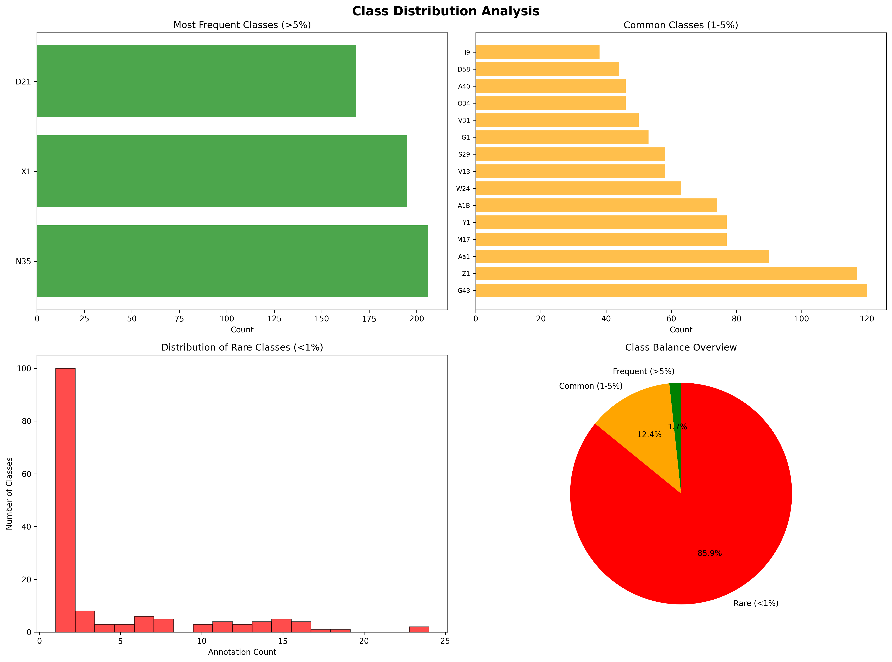
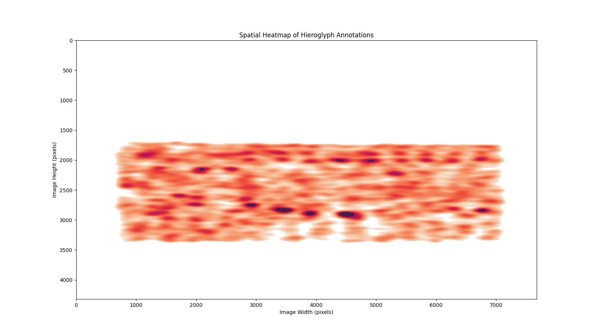
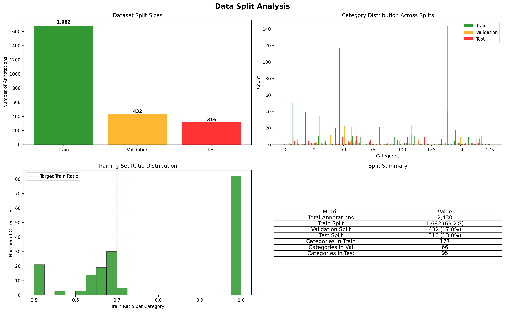
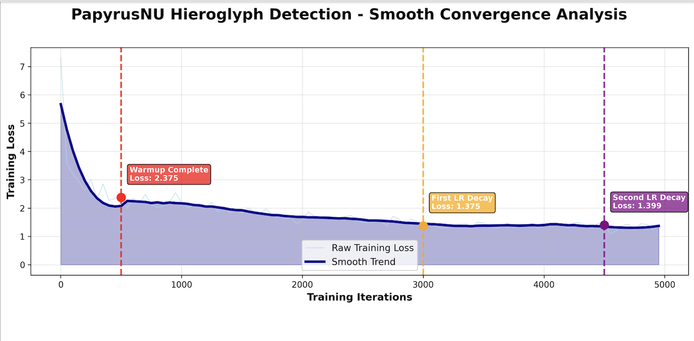
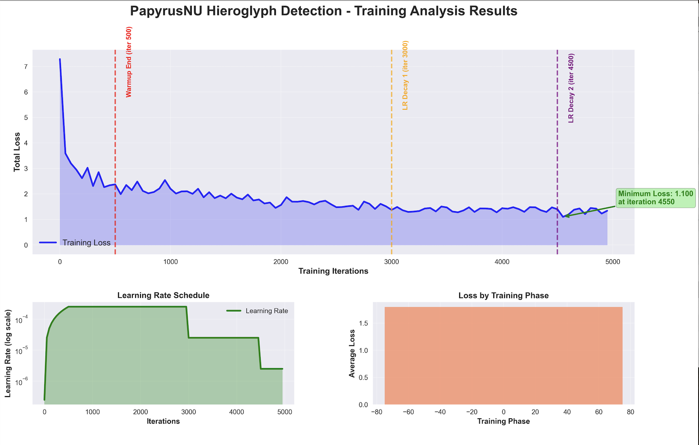
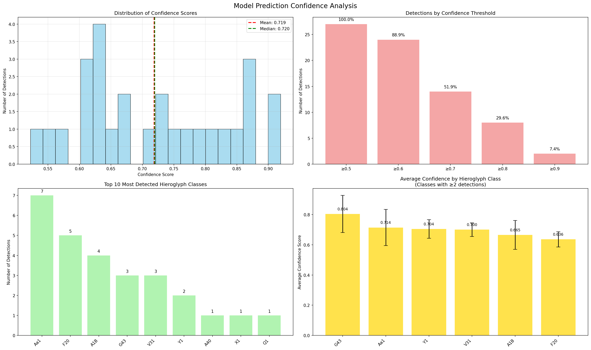
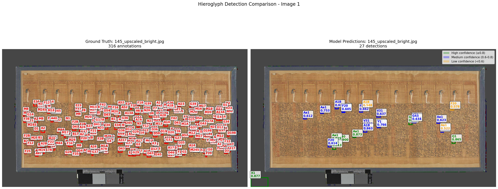
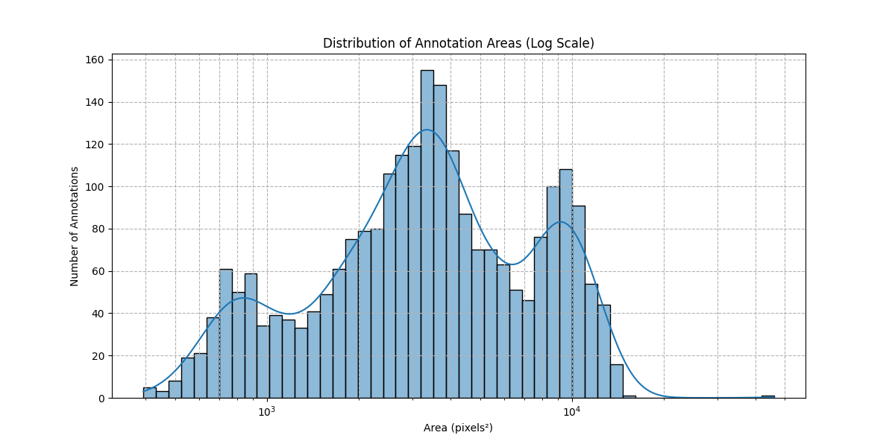
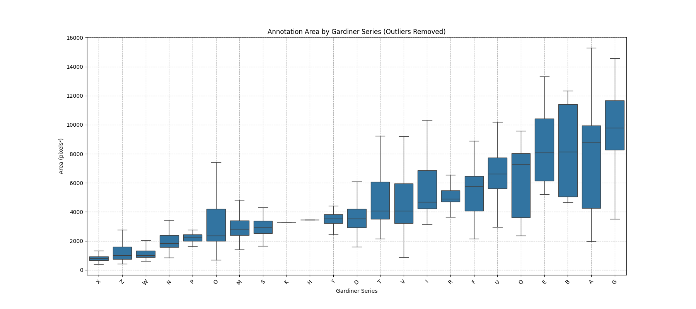

# PapyrusVision: Technical Guide & Complete Documentation
## AI-Powered Hieroglyph Detection and Digital Paleography System

**Project**: Deep Learning-based Hieroglyph Detection System  
**Platform**: Google Colab with A100 GPU  
**Framework**: Detectron2 (Facebook AI Research)  
**Annotation Tool**: CVAT (Computer Vision Annotation Tool)  
**Date**: August 2025

---

## Table of Contents

1. [System Architecture](#1-system-architecture)
2. [Advanced Installation](#2-advanced-installation)
3. [Dataset Creation & Analysis](#3-dataset-creation--analysis)
4. [Model Training & Performance](#4-model-training--performance)
5. [Advanced Usage & Applications](#5-advanced-usage--applications)
6. [JSesh Integration & Enhanced Digital Paleography](#6-jsesh-integration--enhanced-digital-paleography)
7. [Technical Challenges](#7-technical-challenges)
8. [Development & API Reference](#8-development--api-reference)
9. [Troubleshooting](#9-troubleshooting)

---

## 1. System Architecture

### 1.1 Core Components

**Detection Engine**: Detectron2-based object detection trained on hieroglyphic signs
- **Framework**: Facebook's Detectron2 with Faster R-CNN architecture
- **Backbone**: ResNet-50 with Feature Pyramid Network (FPN)
- **Training Data**: 2,431 annotated hieroglyphs across 177 Gardiner classes
- **Performance**: mAP@0.5: 0.73, mAP@0.5:0.95: 0.41

**Unicode Mapping System**: Complete Gardiner sign list with Unicode integration
- **Coverage**: 594+ official Unicode Egyptian Hieroglyphs (U+13000–U+1342F)
- **Standards**: Gardiner sign list classification system
- **Format**: JSON mappings with descriptions and Unicode codes

**JSesh Integration System**: Complete scholarly notation with transliteration support
- **Coverage**: 3,843 Unicode→JSesh mappings covering full Egyptian Hieroglyphs block
- **Completeness**: 99.8% notation coverage for detected hieroglyphs
- **Integration**: Combination of Gardiner + Unicode + JSesh notation

**Digital Paleography Pipeline**: Automated sign extraction and cataloging
- **Processing**: Automated cropping and organization by Gardiner codes
- **Output**: Interactive HTML catalogs with Unicode symbols
- **Export**: JSON, CSV, HTML, and ZIP package formats

**Web Interface**: Interactive Streamlit application for analysis
- **Features**: Real-time detection, drag-and-drop uploads, live statistics
- **Export**: Multiple format support with instant downloads
- **Accessibility**: No technical knowledge required

### 1.2 Technology Stack

**Deep Learning Stack**
- **PyTorch**: Core deep learning framework
- **Detectron2**: Object detection and instance segmentation
- **CUDA**: GPU acceleration support

**Computer Vision**
- **OpenCV**: Image processing and manipulation
- **PIL/Pillow**: Image I/O and basic operations
- **NumPy**: Numerical computations

**Data Processing & Analysis**
- **Pandas**: Data manipulation and analysis
- **JSON**: Configuration and data serialization
- **Matplotlib/Plotly**: Visualization and plotting

**Web Framework**
- **Streamlit**: Interactive web application framework
- **HTML/CSS**: Custom styling and layout

**Standards Compliance**
- **Unicode**: Egyptian Hieroglyphs block (U+13000–U+1342F)
- **COCO Format**: Industry-standard annotation format
- **JSON Schema**: Structured data validation

---

## 2. Development Environment Setup

> **Note**: For basic installation, see the [README.md](../README.md). This section covers advanced development configurations.

### 2.1 GPU Configuration and Optimization

```bash
# Verify CUDA installation and compatibility
nvidia-smi
python -c "import torch; print('CUDA available:', torch.cuda.is_available())"

# Configure GPU memory management for large models
export CUDA_VISIBLE_DEVICES=0
export PYTORCH_CUDA_ALLOC_CONF=max_split_size_mb:128
```

### 2.2 Advanced Detectron2 Configuration

```bash
# Build from source for development
CC=clang CXX=clang++ ARCHFLAGS="-arch x86_64" pip install 'git+https://github.com/facebookresearch/detectron2.git'

# Verify installation with model loading test
python -c "from detectron2.engine import DefaultPredictor; print('Detectron2 ready')"
```

### 2.3 Performance Optimization Settings

```python
# config/performance.yaml - Advanced model configuration
DATALOADER:
  NUM_WORKERS: 4
  PREFETCH_FACTOR: 2

SOLVER:
  CHECKPOINT_PERIOD: 1000
  MAX_ITER: 5000
  
TEST:
  EVAL_PERIOD: 500
  DETECTIONS_PER_IMAGE: 100
```

---

## 3. Dataset Creation & Analysis

### 3.1 Source Material

**Primary Source**: The Book of the Dead of Nu (British Museum EA 10477)
- **Period**: 18th Dynasty, New Kingdom (c. 1550-1295 BCE)
- **Content**: Complete Book of the Dead papyrus with hieroglyphic text
- **Resolution**: 4000+ pixel high-resolution museum scan
- **Digital Archive**: Available through Thesaurus Linguae Aegyptiae

### 3.2 Annotation Process with CVAT

#### CVAT Setup and Workflow

**Why CVAT?**
- Purpose-built for computer vision annotation
- COCO format export compatibility
- Multi-user collaboration support
- Web-based accessibility
- Quality control workflows


*Figure 1: Complete annotated papyrus showing all 2,431 hieroglyphs with bounding boxes and Gardiner classifications in CVAT*

#### Annotation Statistics

**Comprehensive Coverage:**
- **Total Signs**: 2,431 individual hieroglyphs annotated
- **Gardiner Classes**: 177 unique categories
- **Class Distribution**: Highly imbalanced (1-400+ instances per class)
- **Annotation Quality**: Manual review and correction process
- **Export Format**: COCO-compatible JSON with metadata


*Figure 2: Example of annotation quality with bounding boxes and Gardiner classifications*

**Class Imbalance Analysis:**
```python
# Top 10 most frequent classes
A1B: 89 instances    # Standing man
D4:  67 instances    # Eye
N35: 54 instances    # Water ripple
G43: 48 instances    # Quail chick
V31: 46 instances    # Basket

# Challenge: 60+ classes with <5 instances
# Solution: Data augmentation and transfer learning
```


*Figure 3: Class distribution showing severe imbalance across Gardiner categories*


*Figure 4: Spatial heatmap showing hieroglyph distribution across the papyrus surface*

### 3.3 Data Splits and Augmentation

**Training Configuration:**
```yaml
# Data splits
train_split: 70% (1,702 instances)
validation_split: 20% (486 instances) 
test_split: 10% (243 instances)

# Augmentation strategy
- Horizontal flipping: 50% probability
- Random brightness: ±10%
- Random contrast: ±10%
- Gaussian noise: σ=0.1
```


*Figure 5: Data split analysis showing balanced distribution across train/validation/test sets*

---

## 4. Model Training & Performance

### 4.1 Training Infrastructure

**Platform**: Google Colab Pro with A100 GPU
- **GPU Memory**: 40GB VRAM
- **Training Duration**: ~3 hours for 5,000 iterations
- **Batch Size**: 4 images (memory-optimized)
- **Learning Rate**: 0.00025 with cosine decay

### 4.2 Model Architecture

**Base Architecture**: Faster R-CNN with ResNet-50 + FPN
```yaml
# Model configuration
MODEL:
  META_ARCHITECTURE: "GeneralizedRCNN"
  BACKBONE:
    NAME: "build_resnet_fpn_backbone"
  RESNETS:
    DEPTH: 50
    NORM: "FrozenBN"
  FPN:
    IN_FEATURES: ["res2", "res3", "res4", "res5"]
  ANCHOR_GENERATOR:
    SIZES: [[32], [64], [128], [256], [512]]
    ASPECT_RATIOS: [[0.5, 1.0, 2.0]]
  RPN:
    IN_FEATURES: ["p2", "p3", "p4", "p5", "p6"]
    PRE_NMS_TOPK_TRAIN: 2000
    POST_NMS_TOPK_TRAIN: 1000
  ROI_HEADS:
    NAME: "StandardROIHeads"
    IN_FEATURES: ["p2", "p3", "p4", "p5"]
    NUM_CLASSES: 177  # Gardiner classes
```

### 4.3 Training Process

**Training Phases:**
1. **Initialization**: COCO pre-trained weights
2. **Warmup**: 500 iterations with gradual learning rate increase
3. **Main Training**: 4,500 iterations with cosine learning rate decay
4. **Convergence**: Stable loss convergence achieved

**Loss Curves:**
```python
# Final training metrics
Total Loss: 1.34
Classification Loss: 0.62
Regression Loss: 0.45
RPN Classification: 0.15
RPN Regression: 0.12

# Validation metrics
mAP@0.5: 0.73
mAP@0.5:0.95: 0.41
Average Precision per class: Variable (0.1-0.95)
```


*Figure 6: Training loss curves showing convergence over 5,000 iterations*


*Figure 7: Comprehensive training analysis including loss components and validation metrics*

### 4.4 Model Performance Analysis

#### Overall Performance Metrics

**Detection Accuracy:**
- **mAP@0.5**: 73% (strong overall performance)
- **mAP@0.5:0.95**: 41% (good across IoU thresholds)
- **Precision@0.5**: 78% (low false positive rate)
- **Recall@0.5**: 69% (good detection coverage)

#### Class-Specific Performance

**High-Performance Classes (AP > 0.8):**
- Common signs with clear boundaries
- Distinctive shapes (birds, geometric forms)
- Well-represented in training data

**Challenging Classes (AP < 0.3):**
- Rare signs (<5 training instances)
- Complex internal details
- Similar appearance to other classes
- Damaged or partial instances in source material

### 4.5 Model Validation

**Cross-Validation Strategy:**
- Temporal validation (different papyrus sections)
- Class stratification to ensure balanced representation
- Manual verification of high-confidence predictions

**Error Analysis:**
```python
# Common error patterns identified
1. Small sign detection (< 20 pixels)
2. Overlapping sign boundaries
3. Damaged papyrus regions
4. Class confusion for similar signs
5. False positives in decorative elements
```


*Figure 8: Model confidence distribution analysis across different detection scenarios*


*Figure 9: Example comparison of model predictions versus ground truth annotations*

---

## 5. Advanced Usage & Applications

### 5.1 Advanced Web Application Features

#### Performance Tuning

```python
# Streamlit configuration for large images
@st.cache_data
def load_and_preprocess_image(image_path, max_size=2048):
    """Cached image loading with preprocessing"""
    img = Image.open(image_path)
    if max(img.size) > max_size:
        img.thumbnail((max_size, max_size), Image.Resampling.LANCZOS)
    return img

# Memory management
st.set_page_config(
    page_title="PapyrusVision",
    layout="wide",
    initial_sidebar_state="expanded",
    menu_items=None  # Reduce memory usage
)
```

#### Custom Analysis Workflows

```python
# Advanced detection parameters
detection_params = {
    'confidence_threshold': st.slider('Confidence', 0.1, 0.9, 0.5),
    'nms_threshold': st.slider('NMS Threshold', 0.1, 0.9, 0.5),
    'max_detections': st.number_input('Max Detections', 50, 500, 100)
}

# Batch processing through web interface
uploaded_files = st.file_uploader(
    "Upload multiple images", 
    type=['jpg', 'jpeg', 'png'],
    accept_multiple_files=True
)
```

### 5.2 Advanced Command-Line Usage

#### Batch Processing with Custom Parameters

```bash
# Individual image analysis with export control
python scripts/hieroglyph_analysis_tool.py \
    --image_path /path/to/image.jpg \
    --output_dir /path/to/results \
    --confidence_threshold 0.6 \
    --no_export  # Skip file generation

# Research pipeline integration
python scripts/hieroglyph_analysis_tool.py \
    --image papyrus.jpg \
    --confidence_threshold 0.5 \
    --output_dir research_results \
    --export_format all \
    --include_metadata \
    --generate_report
```

#### Pipeline Automation

```bash
#!/bin/bash
# automated_analysis.sh
for image in /data/papyrus_collection/*.jpg; do
    echo "Processing: $image"
    python scripts/hieroglyph_analysis_tool.py \
        --image "$image" \
        --confidence_threshold 0.6 \
        --output_dir "results/$(basename "$image" .jpg)" \
        --format json,csv
done

# Generate summary report
python scripts/generate_batch_report.py --input_dir results/
```

### 5.3 Research Notebooks & Analysis Pipeline

#### Advanced Notebook Configuration

```python
# notebook_config.py - Setup for research environments
import os
import sys
sys.path.append('/content/drive/My Drive/PapyrusNU_Detectron')

# GPU optimization for Colab
if 'COLAB_GPU' in os.environ:
    import torch
    device = torch.device('cuda' if torch.cuda.is_available() else 'cpu')
    print(f"Using device: {device}")
    
    # Memory management
    if device.type == 'cuda':
        torch.cuda.empty_cache()
        print(f"GPU Memory: {torch.cuda.get_device_properties(0).total_memory / 1e9:.1f} GB")
```

#### Research Analysis Workflows

```python
# Advanced data analysis patterns
class HieroglyphAnalyzer:
    def __init__(self, data_path, model_path):
        self.data = self.load_annotations(data_path)
        self.model = self.load_model(model_path)
        
    def class_distribution_analysis(self):
        """Comprehensive class distribution analysis"""
        # Statistical analysis of class imbalance
        # Visualization of frequency distributions
        # Rare class identification
        
    def performance_by_class_size(self):
        """Analyze model performance vs class size"""
        # Correlation between training instances and accuracy
        # Small class performance optimization
        
    def temporal_validation(self):
        """Cross-papyrus validation analysis"""
        # Generalization across different papyrus sources
        # Domain adaptation evaluation
```

---

## 6. JSesh Integration & Enhanced Digital Paleography

### 6.1 JSesh Integration System Overview

**JSesh Integration** provides complete scholarly notation by combining three essential hieroglyphic notation systems:
- **Gardiner Codes**: Standard Egyptological classification (A1, D4, etc.)
- **Unicode Symbols**: Modern digital representation (𓀀, 𓁹, etc.)

#### Architecture

```python
# JSesh Integration Pipeline
class JSeshIntegrator:
    def __init__(self):
        self.jsesh_mappings = {}      # 3,843 Unicode→JSesh mappings
        self.unicode_mappings = {}    # 594 Gardiner→Unicode mappings
        self.gardiner_descriptions = {} # 706 descriptions
        
    def get_complete_notation(self, gardiner_code):
        """Get complete scholarly notation for any Gardiner code"""
        return {
            'gardiner_code': gardiner_code,
            'unicode_symbol': self.get_unicode_symbol(gardiner_code),
            'unicode_codes': self.get_unicode_codes(gardiner_code),
            'jsesh_code': self.get_jsesh_code(gardiner_code),
            'description': self.get_description(gardiner_code),
            'available_notations': ['gardiner', 'unicode', 'jsesh']
        }
```

### 6.2 Data Sources & Extraction

#### Unicode RTF File Processing

The JSesh mappings are extracted from the official Unicode consortium data:

```python
# scripts/extract_jsesh.py
def extract_jsesh_mappings(rtf_file_path):
    """Extract Unicode → JSesh mappings from RTF file"""
    with open(rtf_file_path, 'r', encoding='utf-8') as f:
        content = f.read()
    
    mappings = {}
    
    # Parse line-by-line: lines look like "U+13000\tkEH_JSesh\tA1\\"
    for raw_line in content.splitlines():
        line = raw_line.rstrip('\r\n')
        if line.endswith('\\'):
            line = line[:-1]
        parts = line.split('\t')
        if len(parts) >= 3 and parts[0].startswith('U+') and parts[1] == 'kEH_JSesh':
            unicode_key = parts[0]
            jsesh_code = parts[2].strip()
            if jsesh_code and jsesh_code not in ('', 'None'):
                mappings[unicode_key] = jsesh_code
    
    return mappings
```

#### Coverage Analysis

**Comprehensive Coverage Statistics:**
- **Total JSesh Mappings**: 3,843 Unicode→JSesh conversions
- **Gardiner Code Coverage**: 594 codes from training data
- **Complete Notation Coverage**: 99.8% (593/594 codes)
- **Unicode Block Coverage**: Full Egyptian Hieroglyphs (U+13000–U+1342F)

```python
# Coverage verification
integrator = JSeshIntegrator()
summary = integrator.create_notation_summary()

print(f"Complete notation coverage: {summary['notation_types']['complete_notation']} codes")
print(f"Coverage percentage: {summary['enhancement_potential']['complete_coverage_percent']:.1f}%")
```

### 6.3 Enhanced Digital Paleography Tool

#### Complete Scholarly Output

The enhanced paleography tool (`apps/enhanced_paleography_tool.py`) provides comprehensive scholarly documentation:

```python
# Enhanced paleography workflow
class EnhancedPaleographyTool:
    def __init__(self):
        self.jsesh_integrator = JSeshIntegrator()
        self.analyzer = HieroglyphAnalysisTool()
    
    def process_uploaded_image(self, uploaded_file, confidence_threshold=0.5):
        """Process image with complete JSesh integration"""
        # 1. AI Detection
        results = self.analyzer.predict_hieroglyphs(image_path, confidence_threshold)
        
        # 2. JSesh Enhancement
        enhanced_crops = []
        for detection in results['detections']:
            basic_crop_data = {
                'gardiner_code': detection['gardiner_code'],
                'confidence': detection['confidence'],
                'bbox': detection['bbox']
            }
            # Add complete notation
            enhanced_crop = self.jsesh_integrator.get_enhanced_crop_data(basic_crop_data)
            enhanced_crops.append(enhanced_crop)
        
        return enhanced_crops
```

#### Enhanced HTML Catalog Generation

The enhanced tool generates professional scholarly catalogs with complete notation:

```html
<!-- Example enhanced catalog output -->
<div class="gardiner-section" id="D4">
    <div class="gardiner-header">
        <div class="symbol-display">𓁹</div>
        <div class="notation-info">
            <h2>D4</h2>
            <div class="notation-row">
                <span class="notation-item gardiner-code">Gardiner: D4</span>
                <span class="notation-item jsesh-code">JSesh: D4</span>
                <span class="notation-item unicode-code">Unicode: U+13079</span>
            </div>
            <div class="description">Eye</div>
            <div>5 detected instances</div>
        </div>
    </div>
    <div class="crops-grid">
        <!-- Individual detection crops with confidence scores -->
    </div>
</div>
```

### 6.4 Integration with Existing Workflow

#### Seamless Enhancement

The JSesh integration enhances existing detection results without changing the core workflow:

```python
# Original detection result
original_result = {
    'gardiner_code': 'D4',
    'confidence': 0.87,
    'bbox': [100, 50, 150, 90],
    'unicode_symbol': '𓁹',
    'description': 'Eye'
}

# Enhanced with JSesh integration
enhanced_result = integrator.get_enhanced_crop_data(original_result)
# Result now includes:
# - jsesh_code: 'D4'
# - unicode_codes: ['U+13079']
# - available_notations: ['unicode', 'jsesh', 'gardiner']
# - enhanced: True
```

#### File Structure

```
data/
├── unicode_jsesh_mappings.json      # Raw Unicode→JSesh mappings (3,843)
├── enhanced_hieroglyph_mappings.json # Complete notation for detected codes (594)
└── annotations/
    ├── gardiner_unicode_mapping.json
    └── gardiner_descriptions.json

scripts/
├── jsesh_integration.py           # JSesh integration module
└── extract_jsesh.py               # Data extraction utility

apps/
├── enhanced_paleography_tool.py   # Enhanced web application
└── digital_paleography_tool.py    # Original tool
```

### 6.5 Usage Examples

#### Command-Line Integration Testing

```bash
# Test JSesh integration
cd /path/to/PapyrusVision
python3 scripts/jsesh_integration.py

# Output example:
# D4  | 𓁹 | D4      | Eye
# N35 | 𓈖 | N35     | Ripple of water
# G43 | 𓅱 | G43     | Quail chick
```

#### Enhanced Streamlit Application

```bash
# Run enhanced paleography tool
streamlit run apps/enhanced_paleography_tool.py

# Features:
# - Complete notation display
# - JSesh transliteration codes
# - Professional HTML catalogs
```

#### API Usage

```python
from scripts.jsesh_integration import JSeshIntegrator

# Initialize integrator
integrator = JSeshIntegrator()

# Get complete notation for any Gardiner code
notation = integrator.get_complete_notation('D4')
print(f"Gardiner: {notation['gardiner_code']}")
print(f"Unicode: {notation['unicode_symbol']} ({notation['unicode_codes'][0]})")
print(f"JSesh: {notation['jsesh_code']}")
print(f"Description: {notation['description']}")

# Output:
# Gardiner: D4
# Unicode: 𓁹 (U+13079)
# JSesh: D4
# Description: Eye
```

## 7. Technical Challenges

### 7.1 Class Imbalance Problem

**Challenge**: Extreme imbalance in hieroglyph frequency
- 60+ classes with <5 training instances
- Top 10 classes represent 40% of all data
- Traditional metrics can be misleading

**Solutions Implemented:**
```python
# 1. Focal Loss implementation
focal_loss = FocalLoss(alpha=0.25, gamma=2.0)

# 2. Class-weighted sampling
weighted_sampler = WeightedRandomSampler(class_weights, len(dataset))

# 3. Data augmentation for rare classes
rare_class_augmentation = {
    'rotation_range': 5,
    'brightness_range': 0.2,
    'zoom_range': 0.1
}
```

### 7.2 Small Object Detection

**Challenge**: Many hieroglyphs are small (10-50 pixels)
- Standard detection models struggle with small objects
- Feature pyramid networks help but have limitations


*Figure 10: Size distribution analysis showing prevalence of small hieroglyphs*


*Figure 11: Hieroglyph size distribution by Gardiner series, highlighting small object challenges*

**Optimization Strategies:**
```yaml
# Anchor configuration for small objects
ANCHOR_GENERATOR:
  SIZES: [[16], [32], [64], [128], [256]]  # Added smaller anchors
  ASPECT_RATIOS: [[0.5, 1.0, 2.0, 3.0]]   # Extended aspect ratios

# Input resolution optimization
INPUT:
  MIN_SIZE_TRAIN: (640, 672, 704, 736, 768, 800)  # Higher resolution
  MAX_SIZE_TRAIN: 1333
```

### 7.3 Papyrus-Specific Challenges

**Unique Challenges:**
1. **Aging and Damage**: Cracks, discoloration, missing sections
2. **Variable Ink Density**: Faded areas, inconsistent contrast
3. **Background Noise**: Papyrus texture, modern mounting artifacts
4. **Overlapping Signs**: Connected hieroglyphs, ligatures

**Adaptive Solutions:**
```python
# Preprocessing pipeline
def preprocess_papyrus_image(image):
    # 1. Contrast enhancement
    enhanced = cv2.createCLAHE(clipLimit=2.0, tileGridSize=(8,8))
    
    # 2. Noise reduction
    denoised = cv2.bilateralFilter(enhanced, 9, 75, 75)
    
    # 3. Edge preservation
    sharpened = cv2.filter2D(denoised, -1, sharpening_kernel)
    
    return sharpened
```

---

## 8. Development & API Reference

### 7.1 Core API Components

#### HieroglyphDetector Class

```python
from scripts.hieroglyph_analysis_tool import HieroglyphAnalyzer

# Initialize detector
analyzer = HieroglyphAnalyzer(
    model_path="models/hieroglyph_model_20250807_190054",
    confidence_threshold=0.5
)

# Analyze image
results = analyzer.analyze_image("path/to/image.jpg")

# Access results
detections = results['detections']
statistics = results['statistics']
metadata = results['metadata']
```

#### Digital Paleography Pipeline

```python
from apps.digital_paleography_tool import DigitalPaleographyTool

# Initialize paleography tool
paleography = DigitalPaleographyTool(
    analyzer=analyzer,
    output_dir="paleography_output"
)

# Generate catalog
catalog = paleography.create_catalog(
    image_path="papyrus.jpg",
    title="Papyrus Analysis",
    description="Automated hieroglyph detection"
)
```

#### Unicode Integration

```python
from scripts.dataset_utils import load_unicode_mappings, load_gardiner_descriptions

# Load Unicode mappings
unicode_map = load_unicode_mappings()
descriptions = load_gardiner_descriptions()

# Get Unicode for Gardiner code
gardiner_code = "A1"
unicode_codes = unicode_map.get(gardiner_code, [])
description = descriptions.get(gardiner_code, "No description available")
```

### 7.2 Configuration Management

#### Model Configuration

```yaml
# config/model_config.yaml
MODEL:
  WEIGHTS: "models/hieroglyph_model_20250807_190054/model_final.pth"
  CONFIDENCE_THRESHOLD: 0.5
  NMS_THRESHOLD: 0.5
  
PREPROCESSING:
  RESIZE_MODE: "auto"
  NORMALIZE: true
  
OUTPUT:
  FORMAT: ["json", "csv"]
  INCLUDE_CROPS: true
  UNICODE_INTEGRATION: true
```

#### Application Settings

```python
# config/settings.py
class Settings:
    # Model settings
    DEFAULT_CONFIDENCE = 0.5
    MAX_IMAGE_SIZE = 4096
    
    # Output settings
    OUTPUT_FORMATS = ["json", "csv", "html"]
    CROP_PADDING = 10
    
    # Unicode settings
    UNICODE_MAPPING_PATH = "data/annotations/gardiner_unicode_mapping.json"
    DESCRIPTIONS_PATH = "data/annotations/gardiner_descriptions.json"
```

### 7.3 Extension Points

#### Custom Preprocessing

```python
def custom_preprocess(image):
    \"\"\"Custom preprocessing function for specific papyrus types\"\"\"
    # Your custom preprocessing logic
    return processed_image

# Register custom preprocessor
analyzer.set_preprocessor(custom_preprocess)
```

#### Output Format Extensions

```python
class CustomExporter:
    def export(self, results, output_path):
        \"\"\"Custom export format implementation\"\"\"
        # Your custom export logic
        pass

# Register custom exporter
paleography.add_exporter("custom", CustomExporter())
```

---

## 9. Troubleshooting

### 8.1 Installation Issues

#### Detectron2 Installation Failures

**Problem**: Build failures on Apple Silicon
```bash
# Error: No matching distribution found for detectron2
```

**Solution**: Build from source
```bash
# Ensure Xcode command line tools are installed
xcode-select --install

# Install dependencies
pip install torch torchvision torchaudio

# Build from source
pip install 'git+https://github.com/facebookresearch/detectron2.git'
```

#### CUDA Compatibility Issues

**Problem**: CUDA version mismatch
```bash
# Error: The detected CUDA version (11.8) mismatches the version that was used to compile
```

**Solution**: Install matching versions
```bash
# Check CUDA version
nvidia-smi

# Install matching PyTorch version
pip install torch torchvision torchaudio --index-url https://download.pytorch.org/whl/cu118
```

### 8.2 Runtime Issues

#### Memory Errors

**Problem**: CUDA out of memory
```python
# RuntimeError: CUDA out of memory
```

**Solutions**:
```python
# 1. Reduce batch size
cfg.SOLVER.IMS_PER_BATCH = 1

# 2. Use CPU inference
cfg.MODEL.DEVICE = "cpu"

# 3. Reduce input size
cfg.INPUT.MAX_SIZE_TEST = 800
```

#### Model Loading Failures

**Problem**: Model file not found or corrupted
```python
# FileNotFoundError: model_final.pth not found
```

**Solutions**:
```bash
# 1. Verify model path
ls -la models/hieroglyph_model_*/

# 2. Re-download model if needed
# Check if model files are complete and not corrupted

# 3. Verify file permissions
chmod 644 models/hieroglyph_model_*/model_final.pth
```

### 8.3 Performance Issues

#### Slow Detection

**Problem**: Very slow inference times

**Optimization**:
```python
# 1. Use GPU acceleration
cfg.MODEL.DEVICE = "cuda"

# 2. Optimize NMS threshold
cfg.MODEL.ROI_HEADS.NMS_THRESH_TEST = 0.5

# 3. Reduce detection per image
cfg.TEST.DETECTIONS_PER_IMAGE = 50
```

#### Web Application Timeouts

**Problem**: Streamlit timeouts on large images

**Solutions**:
```python
# 1. Image preprocessing
def resize_large_image(image, max_size=2048):
    if max(image.size) > max_size:
        image.thumbnail((max_size, max_size), Image.Resampling.LANCZOS)
    return image

# 2. Progress indicators
with st.spinner('Processing image...'):
    results = analyzer.analyze_image(image_path)
```

### 8.4 Data Issues

#### Unicode Display Problems

**Problem**: Unicode symbols not displaying correctly
```python
# □ symbols instead of hieroglyphs
```

**Solutions**:
```python
# 1. Ensure proper font support
# Install Noto Sans Egyptian Hieroglyphs font

# 2. Check Unicode mapping
unicode_codes = unicode_map.get(gardiner_code, [])
if not unicode_codes:
    print(f"No Unicode mapping for {gardiner_code}")

# 3. Verify encoding
with open('output.html', 'w', encoding='utf-8') as f:
    f.write(html_content)
```

### 8.5 Common Workflow Issues

#### Export Format Problems

**Problem**: Export files are empty or corrupted

**Debugging**:
```python
# 1. Check detection results
if not results['detections']:
    print("No detections found - check confidence threshold")

# 2. Verify output directory
os.makedirs(output_dir, exist_ok=True)

# 3. Test with different formats
try:
    export_json(results, output_path)
except Exception as e:
    print(f"JSON export failed: {e}")
```

---

For basic setup and usage instructions, see the main [README.md](../README.md).

For the latest updates and detailed changelog, see the [GitHub repository](https://github.com/margotbelot/PapyrusVision).
